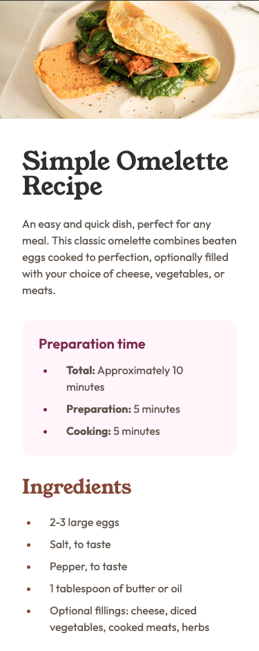

<h1 align="center">
  Recipe page
</h1>

<h3 align="center">
  <a
    href="https://dominguetigs.github.io/frontend-mentor-challenges/challenges/recipe-page/src/index.html"
    target="_blank"
  >DEMO</a>
</h3>

## :bookmark: About

Recipe page using HTML and CSS

## :rocket: Tecnologies

- HTML5
- CSS3

## :iphone: Screens

<h1 align="center">
  
  
</h1>

---

<h4 align="center">
    Coded with 💙 by <a
      href="https://www.linkedin.com/in/dominguetigs/"
      target="_blank"
    >Gustavo Domingueti</a>
</h4>
